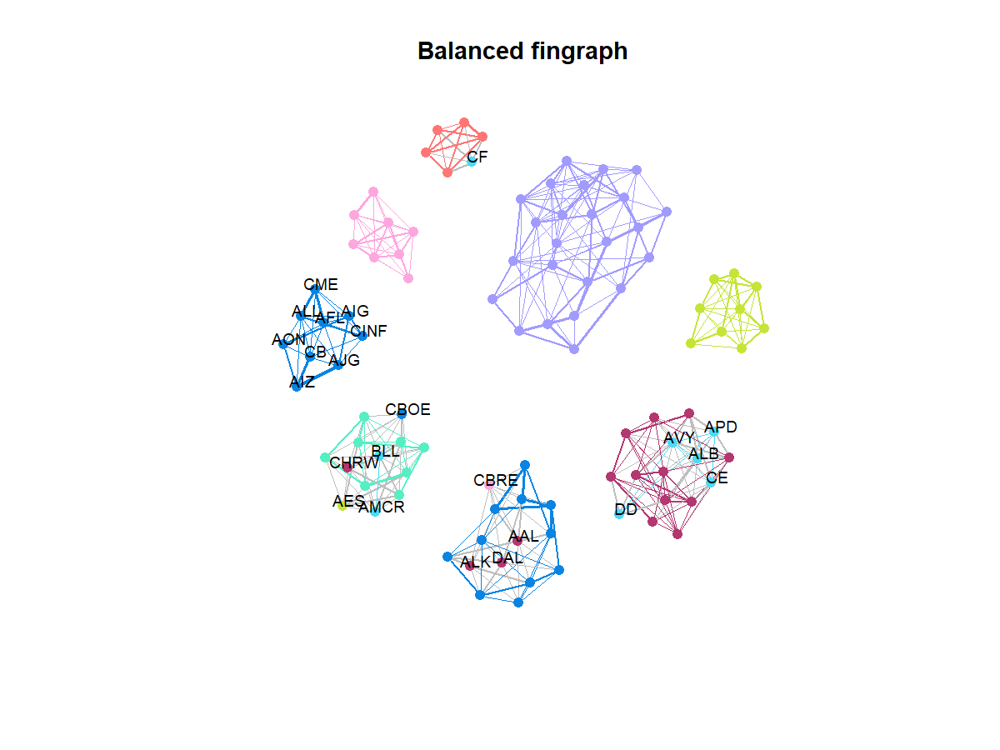

This repo, forked from **fingraph**, contains the R code for balanced undirected graph learning from data
with Student-t distribution applied to financial data clustering. 

## Installation in R

```r
> install.packages(spectralGraphTopology)
> devtools::install_github("javaheriamirhossein/balanced-fingraph")
```

#### Microsoft Windows
On MS Windows environments, make sure to install the most recent version of ``Rtools``.

## Usage

### Learning a graph of stocks

```r
library(fitHeavyTail)
library(xts)
library(quantmod)
library(igraph)
library(readr)
library(spectralGraphTopology)
library(combinat)

# import the balanced fingraph package
library(balancedfingraph)


set.seed(42)

# number of stocks
p <- 100

# number of sectors (clusters)
q <- 8


# load SP500 stock prices_test into an xts table
stock_prices_orig <- readRDS("examples/stocks/sp500-data-2016-2021.rds")
stock_prices <- stock_prices_orig[1:1001,1:p]


# compute log-returns
log_returns <- diff(log(stock_prices), na.pad = FALSE)


# true labels
SP500 <- read_csv("examples/stocks/SP500-sectors.csv")
stock_sectors <- SP500$GICS.Sector[SP500$Symbol %in% colnames(stock_prices)[1:p]]
stock_sectors_index <- as.numeric(as.factor(stock_sectors))


# find nu
nu <- fit_mvt(log_returns, nu = "MLE-diag-resampled")$nu


# first learn a financial graph
graph_fin <- learn_kcomp_heavytail_graph(scale(log_returns), k = q, heavy_type = "student",
                                          nu = nu,
                                          maxiter = 100,
                                          verbose = TRUE)


# then learn a balanced one
graph_fin_balanced <- learn_kcomp_heavytail_graph_balanced(scale(log_returns), k = q, heavy_type = "student",
                                         nu = nu,
                                         alpha = 0.1,
                                         t = 1.2,
                                         maxiter = 100,
                                         verbose = TRUE)


# Plot the graphs and evaluate clustering performance
print("The fingraph clustering performance:")
res_fin <- plot_graph(graph_fin$adjacency, stock_sectors_index, colnames(stock_prices), verbose = TRUE)
title(main =  'Fingraph')
 
# accuracy: 0.52 
# purity: 0.66 
# modularity: 0.6268708 
# balancedness: 0.4968944 
# GINI: 0.515 
# ARI: 0.2885389 
# NMI: 0.4852808 


print("------------------------------")
print("The balanced fingraph clustering performance:")
res_fin_balanced <- plot_graph(graph_fin_balanced$adjacency, stock_sectors_index, colnames(stock_prices),  verbose = TRUE)
title(main =  'Balanced fingraph')

# accuracy: 0.76 
# purity: 0.85 
# modularity: 0.5654208 
# balancedness: 0.7763975 
# GINI: 0.235 
# ARI: 0.7094024 
# NMI: 0.6585227
```





## Citation
Please cite:

-   [A Javaheri](https://javaheriamirhossein.github.io/), [JVM Cardoso](https://mirca.github.io) and
    [DP Palomar](https://www.danielppalomar.com),
    [Graph Learning for Balanced Clustering of Heavy-Tailed Data]([https://papers.nips.cc/paper/2021/hash/a64a034c3cb8eac64eb46ea474902797-Abstract.html](https://ieeexplore.ieee.org/abstract/document/10403460)).
    [2023 IEEE 9th International Workshop on Computational Advances in Multi-Sensor Adaptive Processing](https://ieeexplore.ieee.org/xpl/conhome/10402605/proceeding) (CAMSAP 2023).

-   [JVM Cardoso](https://mirca.github.io), [J Ying](https://github.com/jxying) and
    [DP Palomar](https://www.danielppalomar.com),
    [Graphical Models in Heavy-Tailed Markets](https://papers.nips.cc/paper/2021/hash/a64a034c3cb8eac64eb46ea474902797-Abstract.html).
    [Advances in Neural Information Processing Systems](https://neurips.cc/Conferences/2021) (NeurIPS 2021).


